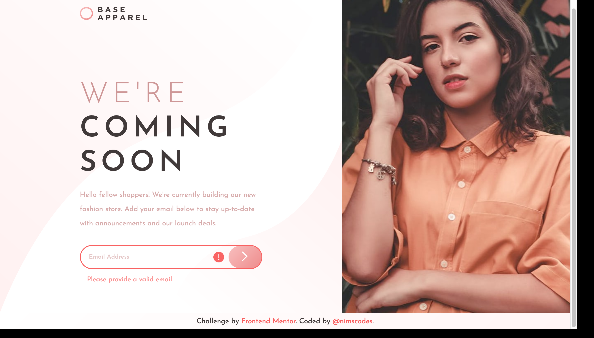

# Frontend Mentor - Base Apparel coming soon page solution

This is a solution to the [Base Apparel coming soon page challenge on Frontend Mentor](https://www.frontendmentor.io/challenges/base-apparel-coming-soon-page-5d46b47f8db8a7063f9331a0). Frontend Mentor challenges help you improve your coding skills by building realistic projects. 

## Table of contents

- [Overview](#overview)
  - [The challenge](#the-challenge)
  - [Screenshot](#screenshot)
  - [Links](#links)
- [My process](#my-process)
  - [Built with](#built-with)
  - [Useful resources](#useful-resources)
- [Author](#author)

## Overview

### The challenge

Users should be able to:

- View the optimal layout for the site depending on their device's screen size
- See hover states for all interactive elements on the page
- Receive an error message when the `form` is submitted if:
  - The `input` field is empty
  - The email address is not formatted correctly

### Screenshot

- Mobile

- Desktop

- Active

### Links

- Solution URL: [https://github.com/nimscodes/base-apparel-landing-page](https://github.com/nimscodes/base-apparel-landing-page)
- Live Site URL: [https://nimscodes.github.io/base-apparel-landing-page/](https://nimscodes.github.io/base-apparel-landing-page/)

## My process

### Built with

- Semantic HTML5 markup
- CSS custom properties
- Flexbox
- Mobile-first workflow
- Vanilla JavaScript

### Useful resources

- [CSS Responsive Image Tutorial: How to Make Images Responsive with CSS](https://www.freecodecamp.org/news/css-responsive-image-tutorial/) - This is an amazing article which helped me finally understand how to nake images fluid based on screen sizes. I'd recommend it to anyone still learning this concept.

## Author

- Website - [Prince Andrews Nimako](https://nimscodes.vercel.app/)
- Frontend Mentor - [@nimscodes](https://www.frontendmentor.io/profile/nimscodes)
